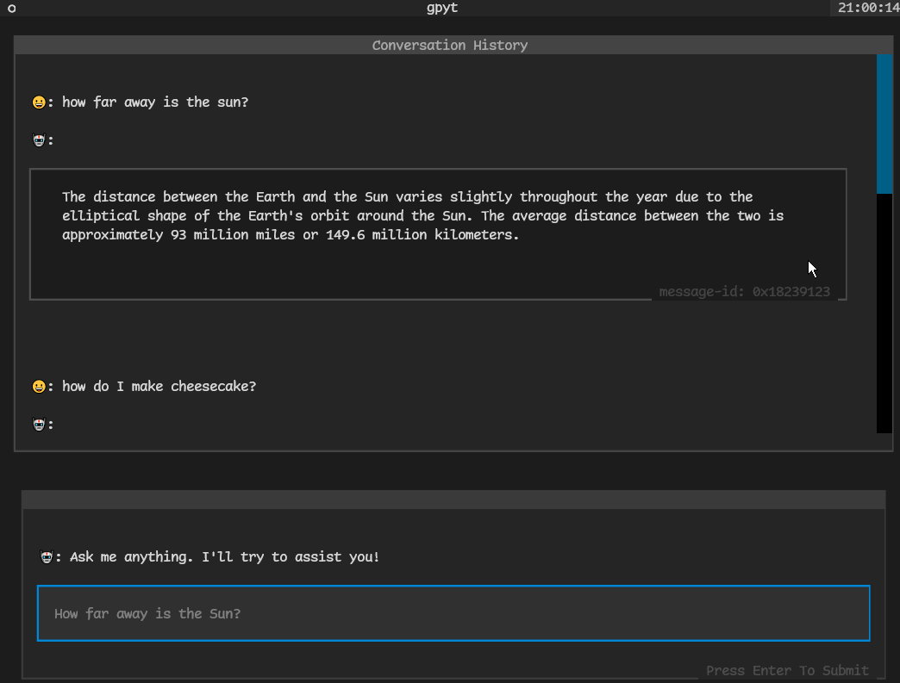

# gpyt

TUI GPT frontend on the command line with Textual.

> WIP


## Demo



Uses [Textual](https://textual.textualize.io).


### How to run:
```sh
$ pip install gpyt

add `OPENAI_API_KEY="<your_openai_api_key>"` in a `.env` at $HOME or `export OPENAI_API_KEY=<your_key>`

$ python -m gpyt
```

### Desired Features

- [ ] `copy` to copy GPT's response to clipboard
- [ ] add gpt jailbreaks (DAN-esque)
- [ ] `new` to start a new chat (clear all history and console window)
- [ ] store chat logs somewhere.
- [ ] add special flags like -t (terse) or -v (verbose) or -d (detailed) or -i
- [ ] (informal) or -f (for file input) or --dan (for jailbreak)
- [ ] model select CLI
- [ ] add API_KEY from CLI


### Completed Features

- [x] loading wheel
- [x] textual !!!
- [x] scrolling text (adjustable speed, or disable all together)
- [x] use streams api?
